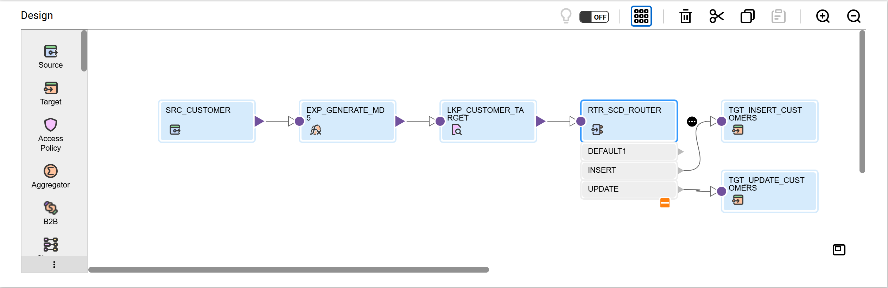

# 🧩 Mapping: m_Customer_SCD_Type1_MD5

## 📘 Objective
Implement **Slowly Changing Dimension (SCD) Type 1** using **MD5 hash comparison** to detect changes in customer attributes and overwrite the existing record with the latest values.

---

## 🏗️ Design Overview
Pipeline flow:
1) **SRC_CUSTOMER** → read source rows  
2) **EXP_GENERATE_MD5** → build MD5 across business columns  
3) **LKP_CUSTOMER_TARGET** → check existing target row + prior MD5  
4) **RTR_SCD_ROUTER** → split into **INSERT** vs **UPDATE**  
5) **TGT_INSERT_CUSTOMERS / TGT_UPDATE_CUSTOMERS** → load

---

## 📊 Mapping Diagram


---

## ⚙️ Transformations & Purpose

| Component | Key Logic / Purpose |
|---|---|
| **SRC_CUSTOMER** | Reads active customers from source system/table |
| **EXP_GENERATE_MD5** | Creates a change-detection hash |
| **LKP_CUSTOMER_TARGET** | Finds existing customer and retrieves stored MD5 |
| **RTR_SCD_ROUTER** | Routes records → **INSERT** (new) / **UPDATE** (changed) |
| **TGT_INSERT_CUSTOMERS** | Inserts brand-new customers |
| **TGT_UPDATE_CUSTOMERS** | Updates attributes for existing customers |

**MD5 expression (example):**
```text
MD5(
  UPPER(TRIM(CUST_NAME)) ||
  UPPER(TRIM(EMAIL)) ||
  TRIM(PHONE) ||
  UPPER(TRIM(ADDRESS1)) ||
  UPPER(TRIM(CITY))
)

---

## 🧪 Sample Data (Before → After)

### 🧮 Before Transformation (Source Data)
| CUST_ID | CUST_NAME     | EMAIL              | PHONE        | CITY   |
|----------|---------------|--------------------|--------------|--------|
| 101 | Rahul Mehta   | rahul@gnail.com  | 9000000000   | Pune   |
| 102 | Asha  Sharma  | ASHA@EXAMPLE.COM | 9876543210  | Delhi  |

### ✅ After Transformation (Target Data)
| CUST_ID | CUST_NAME     | EMAIL             | PHONE         | CITY   |
|----------|---------------|------------------|----------------|--------|
| 101 | Rahul Mehta   | rahul@gmail.com  | +91-9000000000 | Pune   |
| 102 | Asha Sharma   | asha@example.com | +91-9876543210 | Delhi  |
