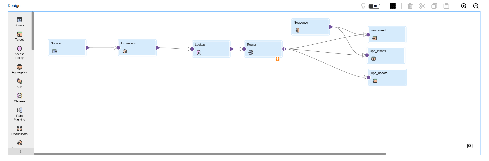

# 📌 SCD Type 2 Mapping (Informatica IICS)

## 🎯 Business Goal
Maintain a **historical record of changes** in dimension data (e.g., customer details, product attributes) so that business users can track both current and past information.  
Example: When a customer changes their address, the system must keep **old** and **new** records with valid date ranges and active/inactive flags.

---

## 🛠️ Technical Design
This mapping follows the **Slowly Changing Dimension Type 2** pattern using Informatica IICS:

- **Source** → Reads customer data from staging (Azure SQL DB / Oracle).
- **Expression Transformation** → Adds metadata fields:
  - `START_DATE` → current system date
  - `END_DATE` → NULL (open record)
  - `IS_ACTIVE` → 'Y'
- **Lookup Transformation** → Compares incoming records with existing target records using business keys.
- **Router Transformation** → Routes records into:
  - **New Insert** → Customer not found in target.
  - **Update Insert** → Customer changed → insert new version.
  - **Update Update** → Expire old version (end date + inactive flag).
- **Sequence Generator** → Generates surrogate keys for dimension table.
- **Target Tables** → Fact-ready dimension with history preserved.

---

## ⚙️ Key Transformations
- **Expression** → Derives MD5 hash of natural keys for comparison.  
- **Lookup** → Detects if record exists (match on key + hash).  
- **Router** → Splits into 3 flows (insert, update/expire, update current).  
- **Sequence Generator** → Surrogate keys for dimension rows.  
- **Multiple Targets** → To handle current row vs expired row updates.

---

## 🚀 Key Achievements
- Preserves **full change history** for audit and analytics.  
- Ensures **data consistency** between staging and target warehouse.  
- Reduced manual SQL by implementing reusable **SCD2 template** in IICS.  
- Supports BI tools (Power BI / Tableau) for **time-based trend analysis**.  

---

## 📸 Mapping Screenshot

---

## 📂 Related Export
- [IICS Job Export (.zip)](../jobs_exports/mct_m_SCD_Type2_Date_MD5-1759765666795.zip)

---

## 🔍 Business Impact
- Enabled **regulatory compliance** (retaining full change logs).  
- Improved **data governance** by tracking effective dates.  
- Helped analysts answer: *“What was the customer’s address at the time of purchase?”*  

---
