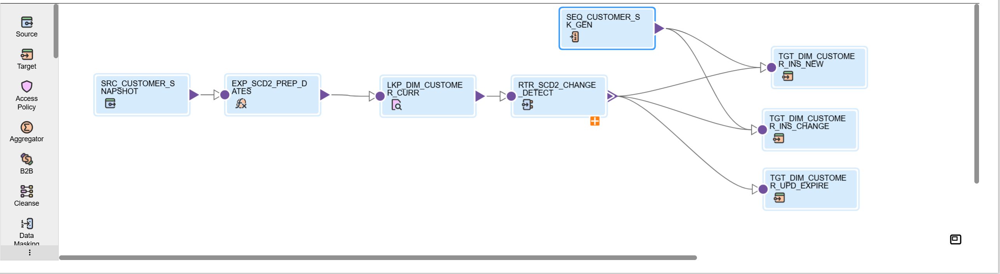

# SCD Type 2 (Date Method) – Informatica IICS

---

### 📌 Business Objective  
Maintain complete historical data for dimension tables (such as Customer or Product) to support analytics, auditing, and compliance.  
When an attribute changes (like address or mobile number), the previous record is expired and a new record is inserted with updated details and validity dates.

---

### 🛠️ Technical Design  
**Flow:**  
`Source → Expression → Lookup → Router → Sequence Generator → Targets`  

| Step | Transformation | Purpose |
|------|----------------|----------|
| 1️⃣ | **Source (SRC_CUSTOMER_SNAPSHOT)** | Reads customer data from staging or transactional table. |
| 2️⃣ | **Expression (EXP_SCD2_PREP_DATES)** | Adds SCD2 control fields such as `EFF_START_DT`, `EFF_END_DT`, and `IS_CURRENT`. |
| 3️⃣ | **Lookup (LKP_DIM_CUSTOMER_CURR)** | Looks up target dimension to check if the record already exists and fetches current version. |
| 4️⃣ | **Router (RTR_SCD2_CHANGE_DETECT)** | Routes data into groups — new inserts, changed records, and unchanged records. |
| 5️⃣ | **Sequence Generator (SEQ_CUSTOMER_SK_GEN)** | Generates unique surrogate keys for new and changed records. |
| 6️⃣ | **Targets** | Handles three operations: Insert new, Insert changed, Update expired. |

---

### ⚙️ Transformation Logic  

**Expression (EXP_SCD2_PREP_DATES):**  
```text
EFF_START_DT = SYSDATE()
EFF_END_DT   = TO_DATE('9999-12-31','YYYY-MM-DD')
IS_CURRENT   = 'Y'
```

**Lookup (LKP_DIM_CUSTOMER_CURR):**  
- Object: `CORE.T_CUSTOMER_SCD_DATE`  
- Condition: `CUSTOMER_ID = SRC_CUSTOMER_ID AND IS_CURRENT = 'Y'`  
- Return Fields: `CUSTOMER_KEY, FIRST_NAME, ADDRESS, MOBILE, ZIPCODE, EFF_START_DT, END_DATE`

**Router (RTR_SCD2_CHANGE_DETECT):**  
| Output Group | Condition | Description |
|---------------|------------|-------------|
| **INSERT_NEW** | `ISNULL(LKP_CUSTOMER_KEY)` | For brand new customers not in the target. |
| **INSERT_CHANGE** | `NOT ISNULL(LKP_CUSTOMER_KEY) AND (FIRST_NAME <> LKP_FIRST_NAME OR ADDRESS1 <> LKP_ADDRESS OR MOBILE <> LKP_MOBILE OR ZIPCODE <> LKP_ZIPCODE)` | For customers with changed attributes. |
| **UNCHANGED** | `NOT ISNULL(LKP_CUSTOMER_KEY) AND FIRST_NAME = LKP_FIRST_NAME AND ADDRESS1 = LKP_ADDRESS AND MOBILE = LKP_MOBILE AND ZIPCODE = LKP_ZIPCODE` | Optional; usually dropped. |

**Sequence Generator (SEQ_CUSTOMER_SK_GEN):**  
- Generates surrogate key using `NEXTVAL` for all inserts.  

**Target Load Strategy:**  
| Target | Load Type | Description |
|---------|------------|-------------|
| **TGT_DIM_CUSTOMER_INS_NEW** | Insert | Inserts brand-new customer records. |
| **TGT_DIM_CUSTOMER_INS_CHANGE** | Insert | Inserts changed customer records as new versions. |
| **TGT_DIM_CUSTOMER_UPD_EXPIRE** | Update | Updates old records by setting `EFF_END_DT = SYSDATE() - 1` and `IS_CURRENT = 'N'`. |

---

### 🧾 Target Table Structure  

| Column Name | Description |
|--------------|-------------|
| CUSTOMER_KEY | Surrogate key (Primary Key) |
| CUSTOMER_ID | Natural key from source |
| FIRST_NAME | Customer name |
| ADDRESS1 | Customer address |
| MOBILE | Contact number |
| ZIPCODE | Postal code |
| COUNTRY | Country name |
| EFF_START_DT | Record effective start date |
| EFF_END_DT | Record effective end date |
| IS_CURRENT | ‘Y’ for active, ‘N’ for inactive |
| LOAD_TS | Load timestamp |

---

### ✅ Highlights  
- Preserves complete change history for analytics and audit trails.  
- Enables point-in-time analysis of customer data.  
- Supports efficient change tracking through direct field comparison.  
- Ensures clean surrogate key generation and controlled expiry logic.  

---

### 📸 Mapping Screenshot  


---

### 🔗 Related Export  
[Download Job Export (.zip)](../jobs_exports/m_CUSTOMER_SCD_Type_2_date-1760383465690.zip?raw=1)
