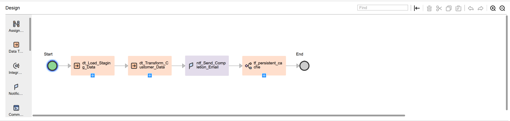

# Taskflow: tf_Parameter_Driven_Orchestration

> **Category:** Taskflow Orchestration | **Technique:** Parameter Set Integration + Sub-Taskflow Dependency

---

##  Objective
Automate and orchestrate multiple data tasks using a **parameter-driven approach**.  
This taskflow demonstrates how to pass runtime parameters across sequential data tasks, trigger notifications, and invoke a dependent sub-taskflow for cache refresh.

---

##  Taskflow Overview
| # | Type | Name | Description |
|---|------|------|-------------|
| 1 | Start | Start | Initializes runtime parameters from a predefined Parameter Set asset. |
| 2 | Data Task | `dt_Load_Staging_Data` | Loads daily or incremental source data into the staging area. |
| 3 | Data Task | `dt_Transform_Customer_Data` | Applies cleansing and transformation logic using runtime parameters. |
| 4 | Notification Task | `ntf_Send_Completion_Email` | Sends execution status and parameter values via email notification. |
| 5 | Sub-Taskflow | `tf_Refresh_Persistent_Cache` | Calls sub-taskflow to rebuild persistent cache or dependent lookup tables. |
| 6 | End | End | Marks successful completion of the parameter-driven orchestration. |

---

##  Mappings Executed
- [`m_Load_Staging_Data`](../CDI/mappings/m_Load_Staging_Data.png)  
- [`m_Transform_Customer_Data`](../CDI/mappings/m_Transform_Customer_Data.png)

---

##  Sub-Taskflow Dependency
This orchestration invokes a supporting sub-taskflow to refresh cache tables after the main data processing:

| Sub-Taskflow | Purpose |
|---------------|----------|
| [`tf_Refresh_Persistent_Cache`](../CDI/taskflows/tf_Refresh_Persistent_Cache.png) | Rebuilds or refreshes persistent lookup caches used by downstream mappings. |

[Download Sub-Taskflow Export (ZIP)](https://raw.githubusercontent.com/s-h-a-s-h-i-k-a-n-t/iics-projects-portfolio/main/jobs_exports/tf_Refresh_Persistent_Cache-1760825534921.zip)

---

##  Key Highlights
- **Parameterization:** Demonstrates runtime parameter inheritance between tasks.  
- **Reusability:** Centralized control via Parameter Set for environment and date variables.  
- **Notifications:** Automatically informs stakeholders on success or failure.  
- **Chaining:** Integrates dependent taskflows for complete process automation.  
- **Modularity:** Reuses `tf_Refresh_Persistent_Cache` for post-processing cache refresh.

---

##  Taskflow Screenshot

---

##  Download Taskflow Export
[Download Taskflow Export (ZIP)](https://raw.githubusercontent.com/s-h-a-s-h-i-k-a-n-t/iics-projects-portfolio/main/jobs_exports/tf_Parameter_Driven_Orchestration-1760823231527.zip)

---

##  Notes
- Designed and tested by **Shashi Kant** in Informatica IICS.  
- Suitable for both **daily batch** and **parameterized ad-hoc** executions.  
- Demonstrates **production-level orchestration** patterns used in enterprise ETL pipelines.

---

>  **Tip:**  
> This taskflow can be extended with **Decision** steps or additional **Parameter Sets** to manage dynamic source-target pairs across environments.
