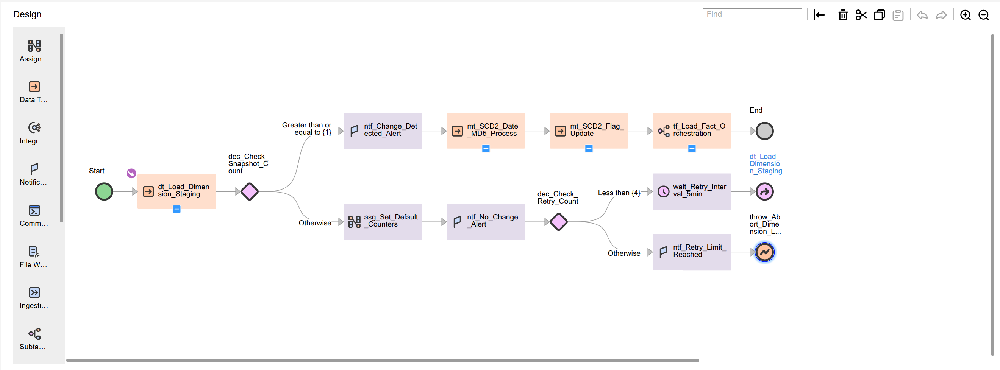

# Taskflow: tf_dimension_loads

## Objective
Automate daily dimension loads using Slowly Changing Dimension Type-2 (SCD2) logic.  
This taskflow orchestrates mappings that detect changes between daily snapshots, expire old versions, and insert new versions while preserving history.

---

## Taskflow Screenshot

---

## Download Taskflow Export
[Download Taskflow Export (ZIP)](../jobs_exports/tf_dimension_loads-1760639743112.zip)

---

## Step-by-Step Taskflow Logic

| Step | Task Name | Type | Description |
|-----:|-----------|------|-------------|
| 1 | Start | — | Initialize runtime parameters (e.g., `$$RUN_DATE`). |
| 2 | dt_Load_Dimension_Staging | Data Task | Load current snapshot to staging and compute snapshot count. |
| 3 | dec_Check_Snapshot_Count | Decision | If count ≥ 1, continue; else end with no-change path. |
| 4 | ntf_Change_Detected_Alert | Notification | Email notification on detected changes. |
| 5 | mt_SCD2_Date_MD5_Process | Mapping Task | Apply SCD2 using MD5 comparison; route INSERT/UPDATE/EXPIRE; set dates. |
| 6 | mt_SCD2_Flag_Update | Mapping Task | Reconcile `IS_ACTIVE` and date ranges for latest versions. |
| 7 | Audit_Run_Summary (optional) | Mapping Task | Write run metrics (read/insert/update/expire) to audit table. |
| 8 | End | — | Complete flow and clear parameters. |

---

## Sample Dataset

### Day-1 Snapshot
| CUSTOMER_ID | CUSTOMER_NAME | CITY   | EMAIL                  | LOAD_DATE   |
|------------:|---------------|--------|------------------------|-------------|
| 101 | Rahul Mehta | Mumbai | rahul.m@example.com | 2025-10-15 |
| 102 | Sneha Iyer  | Pune   | sneha.iyer@example.com | 2025-10-15 |
| 103 | Rajiv Soni  | Delhi  | rajiv.soni@example.com | 2025-10-15 |

### Day-2 Snapshot
| CUSTOMER_ID | CUSTOMER_NAME | CITY       | EMAIL                   | LOAD_DATE   |
|------------:|---------------|------------|-------------------------|-------------|
| 101 | Rahul Mehta | Bangalore | rahul.m@example.com      | 2025-10-16 |
| 102 | Sneha Iyer  | Pune       | sneha.iyer@example.com   | 2025-10-16 |
| 103 | Rajiv Soni  | Delhi      | rajiv.soni@example.com   | 2025-10-16 |
| 104 | Neha Gupta  | Chennai    | neha.gupta@example.com   | 2025-10-16 |

---

## Expected Target After Taskflow Run (SCD2)

| DIM_KEY | CUSTOMER_ID | CUSTOMER_NAME | CITY      | EMAIL                   | START_DATE | END_DATE   | IS_ACTIVE |
|--------:|------------:|---------------|-----------|-------------------------|------------|------------|---------:|
| 1 | 101 | Rahul Mehta | Mumbai    | rahul.m@example.com     | 2025-10-15 | 2025-10-16 | 0 |
| 2 | 101 | Rahul Mehta | Bangalore | rahul.m@example.com     | 2025-10-16 | 9999-12-31 | 1 |
| 3 | 102 | Sneha Iyer  | Pune      | sneha.iyer@example.com  | 2025-10-15 | 9999-12-31 | 1 |
| 4 | 103 | Rajiv Soni  | Delhi     | rajiv.soni@example.com  | 2025-10-15 | 9999-12-31 | 1 |
| 5 | 104 | Neha Gupta  | Chennai   | neha.gupta@example.com  | 2025-10-16 | 9999-12-31 | 1 |

---

## Notes
- Demonstrates complete SCD2 (Date + MD5) with historical tracking via `START_DATE`, `END_DATE`, and `IS_ACTIVE`.
- Replace the ZIP link if you re-export and the timestamp changes.
- Keep the PNG name exactly `tf_dimension_loads.png` to match the link above.

