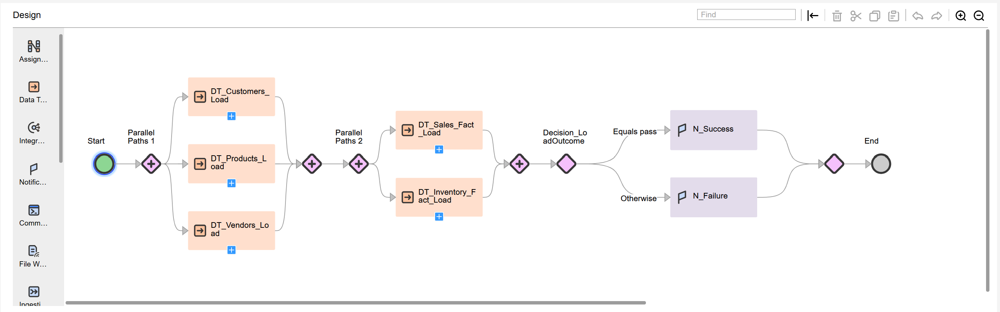

# Taskflow: tf_Parallel_decision

## Objective
Demonstrate parallel execution and conditional branching in Informatica IICS.  
This Taskflow executes multiple Data Tasks concurrently, then evaluates their outcomes using a Decision step to send automated notifications.

---

## Taskflow Screenshot

---

## Download Taskflow Export
[Download Taskflow Export (ZIP)](../jobs_exports/tf_Parallel_decision-1760158878552.zip)

---

## Step-by-Step Flow

| # | Step Name | Type | Description |
|---:|------------|------|-------------|
| 1 | **Start** | Start | Initializes runtime parameters such as `$$RUN_DATE` and `$$BATCH_ID`. |
| 2 | **Parallel Paths 1** | Parallel | Executes three Data Tasks concurrently. |
| 3 | **DT_Customers_Load** | Data Task | Loads Customer dimension incrementally from staging. |
| 4 | **DT_Products_Load** | Data Task | Loads Product dimension and applies SCD Type-1 updates. |
| 5 | **DT_Vendors_Load** | Data Task | Loads Vendor master data after data-quality validation. |
| 6 | **Parallel Paths 2** | Parallel | Executes two Fact loads simultaneously after all dimensions complete. |
| 7 | **DT_Sales_Fact_Load** | Data Task | Loads Sales fact table and performs surrogate key lookups. |
| 8 | **DT_Inventory_Fact_Load** | Data Task | Loads Inventory fact table and calculates stock balances. |
| 9 | **Decision_LoadOutcome** | Decision | Evaluates overall success or failure of the upstream Data Tasks. |
| 10 | **N_Success** | Notification | Sends success email notification to operations team. |
| 11 | **N_Failure** | Notification | Sends failure email alert to support team. |
| 12 | **End** | End | Completes the Taskflow execution. |

---

## Flow Logic

1. Parallel Paths 1 launches Customer, Product, and Vendor dimension loads at the same time.  
2. After all three finish, Parallel Paths 2 begins Sales and Inventory Fact loads concurrently.  
3. Once both Fact loads complete, the Decision_LoadOutcome step checks task statuses.  
4. If all succeed → N_Success is triggered; otherwise → N_Failure.  
5. Taskflow ends with a unified status.

---

## Key Benefits
- Parallel execution shortens overall ETL runtime.  
- Dependency control ensures Facts run only after Dimensions complete.  
- Conditional branching provides automatic success/failure routing.  
- Email notifications remove the need for manual monitoring.

---

## Related Documentation
- [tf_dimension_loads.md](tf_dimension_loads.md)
- [Parallel_Paths_Explanation.txt](Parallel_Paths_Explanation.txt)
