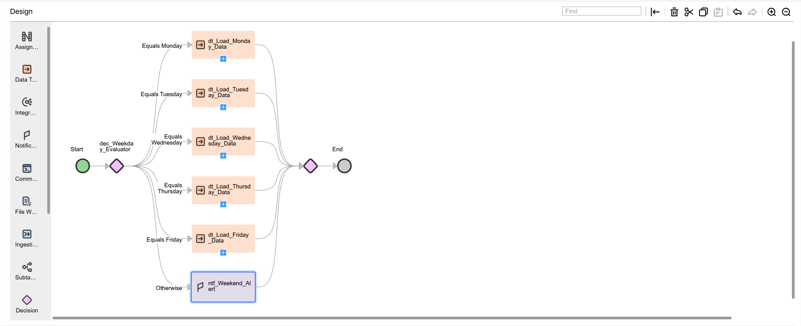

# Taskflow: tf_weekday_taskflow

##  Objective
This taskflow automates daily ETL execution based on the current system weekday.  
It dynamically detects the current day using a date function and triggers the corresponding data load process for that weekday.  
If the system day is Saturday or Sunday, it automatically sends a weekend alert notification instead of running any ETL job.

---

##  Taskflow Overview

| # | Step Type | Name | Description |
|--:|-------------|----------------------------|---------------------------------------------|
| 1 | **Start** | `tf_weekday_taskflow` | Entry point of the weekday-based orchestration. |
| 2 | **Decision** | `dec_Weekday_Evaluator` | Evaluates the current day using the expression: `date:toChar(fn:current-dateTime(), 'DAY')`. |
| 3 | **Data Task** | `dt_Load_Monday_Data` | Loads Monday batch files received from the vendor portal. |
| 4 | **Data Task** | `dt_Load_Tuesday_Data` | Performs data cleansing and transformation for active vendors. |
| 5 | **Data Task** | `dt_Load_Wednesday_Data` | Refreshes mid-week sales and order transactions. |
| 6 | **Data Task** | `dt_Load_Thursday_Data` | Loads billing and payment updates into the data mart. |
| 7 | **Data Task** | `dt_Load_Friday_Data` | Consolidates all processed data for weekly reporting. |
| 8 | **Notification Task** | `ntf_Weekend_Alert` | Sends an email alert for Saturday and Sunday runs indicating “No ETL job scheduled.” |
| 9 | **End** | `end_Weekday_Flow` | Marks successful completion of weekday orchestration. |

---

##  Key Highlights
- **Dynamic Decision Logic:** Automatically detects the weekday from system time without manual input.  
- **Daily Scheduling:** Used to execute different IICS mappings on specific weekdays.  
- **Error-Free Automation:** Prevents accidental weekend job execution through conditional routing.  
- **Operational Efficiency:** Ensures the correct job runs each day, improving pipeline stability.  
- **Production Use:** Deployed in the Ideal Electrical Solutions ETL environment to manage day-based job triggers.

---

##  Taskflow Screenshot

---

##  Download Taskflow Export
[Download Taskflow Export (ZIP)](https://raw.githubusercontent.com/s-h-a-s-h-i-k-a-n-t/iics-projects-portfolio/main/jobs_exports/tf_weekday_taskflow-1760862643656.zip)

---

##  Implementation Summary
This taskflow is used in the **Ideal Electrical Solutions ETL scheduling framework** to control weekday-based job execution.  
It automatically runs vendor synchronization, data cleansing, order transformation, billing, and sales consolidation pipelines on their respective days.  
Weekend runs are blocked with a system notification, ensuring clean operational scheduling without human intervention.

---

##  Notes
- Developed and tested by **Shashi Kant** in **Informatica IICS**.  
- Demonstrates **date-based orchestration** using decision branching and notification tasks.  
- Actively used in the **production-level orchestration setup** at Ideal Electrical Solutions Pvt. Ltd.  
- Simplifies the overall scheduling process by consolidating multiple job triggers into one smart taskflow.
